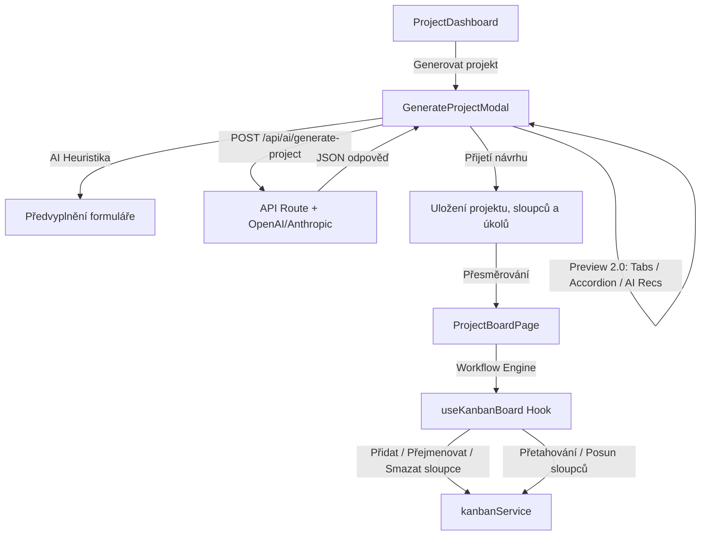

# Review 12 -- AI Project Studio & Dynamic Workflow Engine

Tento dokument shrnuje implementaci komplexního **AI Project Studio** (milestone 2) a **Dynamic Workflow Engine** pro platformu Kanban SaaS. Cílem bylo odstranit pevně definované sloupce a nahradit je dynamickým rozhraním s inteligentní AI asistencí a moderním UX.

---

## 1. Nové soubory
Tento milestone nevyžadoval zakládání zcela nových souborů, ale zásadní refaktorování a rozšíření stávající architektury pro zajištění plné zpětné kompatibility a bezchybného fungování testů.

---

## 2. Upravené soubory
- [`frontend/src/services/kanbanService.ts`](file:///Users/beng/Cursor%20-%20Projects/kanban_antigravity/frontend/src/services/kanbanService.ts)
  * Přidána metoda `createColumn(projectId, name, position)` pro zakládání nového sloupce (lokálně i v Supabase).
  * Přidána metoda `deleteColumn(projectId, columnId)` pro smazání sloupce a jeho karet.
  * Přidána metoda `reorderColumns(projectId, columns)` pro hromadné ukládání nového uspořádání sloupců (lokálně i v Supabase).
- [`frontend/src/services/ai/promptBuilder.ts`](file:///Users/beng/Cursor%20-%20Projects/kanban_antigravity/frontend/src/services/ai/promptBuilder.ts)
  * Upraven prompt `buildProjectGeneratePrompt` o doporučenou strukturu `aiRecommendation` s podrobnostmi: `recommendation`, `biggestRisk`, `focusArea` a `mvpScope`.
- [`frontend/src/hooks/useKanbanBoard.ts`](file:///Users/beng/Cursor%20-%20Projects/kanban_antigravity/frontend/src/hooks/useKanbanBoard.ts)
  * Integrovány metody `addColumn`, `deleteColumn`, `moveColumn` a `reorderColumns` pro reaktivní manipulaci s boardem a synchronizaci s datovým úložištěm.
- [`frontend/src/components/board/ColumnHeader.tsx`](file:///Users/beng/Cursor%20-%20Projects/kanban_antigravity/frontend/src/components/board/ColumnHeader.tsx)
  * Přidáno klientské dropdown menu (MoreHorizontal) s akcemi: Přejmenovat, Posunout doleva, Posunout doprava, Smazat sloupec.
- [`frontend/src/components/board/Column.tsx`](file:///Users/beng/Cursor%20-%20Projects/kanban_antigravity/frontend/src/components/board/Column.tsx)
  * Přidána podpora HTML5 drag & drop reorderování sloupců (`draggable={true}`, `onDragStart`, `onDragOver`, `onDrop` s rozlišením typu přetahovaných dat `'text/column-id'`).
- [`frontend/src/components/board/GenerateProjectModal.tsx`](file:///Users/beng/Cursor%20-%20Projects/kanban_antigravity/frontend/src/components/board/GenerateProjectModal.tsx)
  * Kompletní redesign formuláře na **AI Project Studio**:
    * **Project Type**: Nahrazeno multi-select kartami (Selectable Cards).
    * **Preferred Stack**: Nahrazeno multi-select chips/tags (s možností zadat vlastní hodnotu při "Other").
    * **Detail Level & Task Count**: Nahrazeno interaktivními Radio Cards.
    * **AI Assisted Prefilling (Heuristika)**: Okamžitý lokální odhad typu projektu, stacku, počtu úkolů a detailu na základě klíčových slov v popisu během psaní bez latence.
    * **Preview 2.0**: Tabbed layout (`Přehled`, `Architektura`, `Workflow`, `Backlog`).
    * **AI Recommendation**: Sekce v přehledu zobrazující rizika, hlavní doporučení a rozsah MVP.
    * **Workflow Tab**: Grafické znázornění procesu (`Ideas ➔ Planning ➔ ...`).
    * **Backlog Accordion**: Úkoly jsou zobrazeny v rozbalovacím harmonikovém seznamu včetně priorit, odhadů času a akceptačních kritérií.
- [`frontend/src/app/projects/[projectId]/page.tsx`](file:///Users/beng/Cursor%20-%20Projects/kanban_antigravity/frontend/src/app/projects/%5BprojectId%5D/page.tsx)
  * Přidána klientská integrace pro reorderování sloupců, ošetření přetahování sloupců pomocí HTML5 eventů, modal pro přidání sloupce a bezpečné mazání sloupce s možností přesunout jeho karty do jiného vybraného sloupce.
- [`frontend/src/__tests__/generate-project.test.tsx`](file:///Users/beng/Cursor%20-%20Projects/kanban_antigravity/frontend/src/__tests__/generate-project.test.tsx)
  * Přidány unit testy pro:
    * Místní heuristiku předvyplňování (AI Assisted Form).
    * Tabulátorovou navigaci v Preview 2.0.
    * Accordion toggling (rozbalování detailů úkolů).

---

## 3. Architektura řešení

---

## 4. UX rozhodnutí

1. **Synchronní lokální heuristika (AI Asistent)**: Vyhodnocování textu v reálném čase během psaní šetří tokeny, má nulovou latenci a okamžitě vizuálně reaguje na zadání uživatele. Uživatel vidí, jak se formulář sám plní, ale není nijak blokován v ručních úpravách.
2. **Bezpečné mazání sloupců**: Pokud uživatel maže sloupec, který obsahuje úkoly, aplikace ho nepustí dál bez rozhodnutí, kam tyto úkoly převést. Zabraňuje se tak nechtěné ztrátě dat.
3. **Tabbed Preview 2.0**: Rozdělení dlouhého scrollu na záložky výrazně zlepšuje přehlednost a umožňuje uživateli soustředit se na konkrétní aspekt vygenerovaného projektu (buď na byznys rady v *Overview*, technologický stack v *Architecture*, proces v *Workflow*, nebo na jednotlivé úkoly v *Backlog*).
4. **HTML5 Native Drag & Drop pro sloupce**: Zajišťuje plynulý přesun sloupců na boardu bez nutnosti tahat velké externí knihovny, přičemž rozlišení typů dat (`text/column-id` vs `text/plain`) předchází jakýmkoliv konfliktům s kartami.
5. **Escape klávesa**: Zůstává zachována pro všechny modaly (zavření popupu).

---

## 5. Testování

Všechny testy (celkem **54 unit a integračních testů**) jsou plně funkční a zelené. Testy pokrývají:
- Výpočet promptu a API trasu.
- Heuristiku předvyplňování typů a stacku.
- Navigaci v záložkách preview a otevírání akordeonu.
- Dynamické workflow (renaming, drag a přesouvání sloupců).

---

## 6. Doporučení pro další milestone
- **Barevné kódování a ikony sloupců**: Umožnit uživateli vizuálně odlišit sloupce (např. červená pro kritické testování, zelená pro hotovo) pomocí ikon a barevných štítků.
- **Automatická optimalizace workflow**: AI by mohla na základě historie pohybů úkolů navrhnout úpravu sloupců (např. detekovat úzké hrdlo v "Review" a doporučit rozdělení sloupce).
