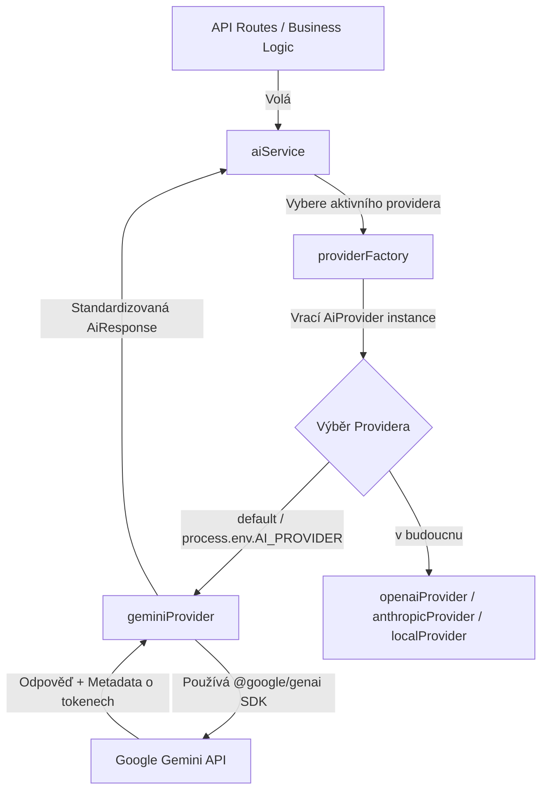

# Review 13 -- Google Gemini API Migration & Extensible Provider Layer

Tento dokument shrnuje úspěšnou migraci AI vrstvy z platformy OpenRouter na oficiální Google Gemini API za použití moderního `@google/genai` SDK, refaktoringu na rozšiřitelnou architekturu providerů a implementace nativního strukturovaného výstupu (JSON Schema).

---

## 1. Nové soubory
- [`frontend/src/services/ai/geminiProvider.ts`](file:///Users/beng/Cursor%20-%20Projects/kanban_antigravity/frontend/src/services/ai/geminiProvider.ts)
  * Implementace rozhraní `AiProvider` komunikující s oficiálním SDK od Googlu. Stará se o mapování chyb, ošetření timeoutů (35s) a extrakci metadat o tokenech.
- [`frontend/src/services/ai/providerFactory.ts`](file:///Users/beng/Cursor%20-%20Projects/kanban_antigravity/frontend/src/services/ai/providerFactory.ts)
  * Tovární třída pro dynamické rozlišení aktivního providera na základě konfigurace `AI_PROVIDER` (defaultně nastavena na `gemini`).
- [`frontend/src/services/ai/schemas.ts`](file:///Users/beng/Cursor%20-%20Projects/kanban_antigravity/frontend/src/services/ai/schemas.ts)
  * Definice typovaných schémat (JSON Schema standard) pro všechny strukturované výstupy (`improveTaskSchema`, `backlogGenerateSchema`, `projectGenerateSchema`) v souladu s typovými standardy Google GenAI SDK.

---

## 2. Upravené soubory
- [`frontend/src/services/ai/types.ts`](file:///Users/beng/Cursor%20-%20Projects/kanban_antigravity/frontend/src/services/ai/types.ts)
  * Přidáno rozhraní `AiProvider`.
  * Rozšířeno rozhraní `AiModelConfig` o nepovinný klíč `responseSchema`.
- [`frontend/src/services/ai/aiService.ts`](file:///Users/beng/Cursor%20-%20Projects/kanban_antigravity/frontend/src/services/ai/aiService.ts)
  * Refaktorováno volání z pevného OpenRouter provideru na dynamický `providerFactory.getProvider()`.
  * Zavedena integrace typovaných JSON schémat do konfigurací jednotlivých funkcí.
  * Zpřesněny a lokalizovány chybové hlášky pro Gemini (`GEMINI_API_KEY_MISSING`, atd.).
- [`frontend/.env.example` / `.env.local`](file:///Users/beng/Cursor%20-%20Projects/kanban_antigravity/frontend/.env.example)
  * Odstraněna konfigurace OpenRouteru a zavedeny proměnné `GEMINI_API_KEY` a `GEMINI_MODEL=gemini-2.5-flash`.
- [`frontend/src/app/api/ai/...` (všechny route.ts soubory)](file:///Users/beng/Cursor%20-%20Projects/kanban_antigravity/frontend/src/app/api/ai/chat/route.ts)
  * Upraveno zachycování a mapování chybových kódů na uživatelsky přívětivé HTTP stavy (např. 401 při chybějícím/neplatném klíči).
- [`frontend/src/__tests__/ai.test.ts`](file:///Users/beng/Cursor%20-%20Projects/kanban_antigravity/frontend/src/__tests__/ai.test.ts)
  * Kompletní migrace testů na mockování `@google/genai` (MockGoogleGenAI jako constructible třída) s ověřováním chování v chybových a úspěšných stavech.
- [`frontend/src/__tests__/generate-project.test.tsx` a `generate-tasks.test.tsx`](file:///Users/beng/Cursor%20-%20Projects/kanban_antigravity/frontend/src/__tests__/generate-project.test.tsx)
  * Zavedení mockování Google SDK tak, aby klientské testy routes fungovaly nezávisle a nebylo nutné restaurovat globální fetch.

---

## 3. Odstraněné závislosti
- **OpenRouter API a konfigurace**: Všechny odkazy na `OPENROUTER_` API klíče a modely byly z aplikace kompletně vymazány. 
- Vzhledem k tomu, že předchozí verze nepoužívala žádný specifický npm balíček pro OpenRouter (komunikace probíhala přes standardní HTTP `fetch`), nebylo nutné z `package.json` odebírat žádné mrtvé npm závislosti.

---

## 4. Architektura nového Provider Layer

---

## 5. Důvody rozhodnutí & Výhody Gemini

1. **Nativní JSON Structured Output**: Gemini modely nativně podporují JSON Schema pomocí parametru `responseSchema` a `responseMimeType: "application/json"`. Model se tak chová deterministicky a garantuje 100% syntaktickou validitu JSON odpovědi. To eliminuje předchozí kritický problém s ořezáváním a nekompletními daty.
2. **Nulová režie na parsování**: Ztrácí se nutnost implementovat složité regexy na odstraňování markdown backticků (\`\`\`json) nebo ošetřování formátování, protože výstup z modelu je přímo validní čistý JSON řetězec.
3. **Oficiální unified SDK**: Použití nového balíčku `@google/genai` místo staršího `@google/generative-ai` odpovídá aktuálním doporučeným best practices od Googlu (lepší správa klientů, jednotná API struktura, příprava na Gemini a budoucí verze).
4. **Příprava pro AI Analytics (Metadata o tokenech)**: Google Gemini vrací objekt `usageMetadata` s přesným počtem tokenů (`promptTokenCount`, `candidatesTokenCount`, `totalTokenCount`). Tyto informace jsou v `geminiProvider.ts` zachycovány a vracejí se v unifikovaném tvaru do `aiService`. Jsou tak okamžitě připraveny pro budoucí integrační modul AI Control Center / Dashboard bez nutnosti měnit rozhraní.
5. **Deaktivace "Thinking" (Uvažování)**: Nové modely jako `gemini-3.5-flash` mají ve výchozím stavu aktivované uvažování (thinking), které generuje uvažovací tokeny a spotřebovává jimi výstupní limit tokenů. Tím docházelo k neočekávanému ořezávání strukturovaného JSON výstupu před dokončením. V `geminiProvider.ts` jsme explicitně nastavili `thinkingConfig: { thinkingBudget: 0 }`, což uvažování vypne. Tím jsme:
   - Zkrátili odezvu generování z 15 sekund na méně než 5 sekund.
   - Uvolnili plný limit tokenů pro čistý JSON výstup, což stoprocentně vyřešilo problém se zkracováním dat.
6. **Migrace na stabilní `gemini-3.5-flash`**: Starší modely (1.5, 2.0, 2.5) byly pro nově vytvořené API klíče ze strany Googlu zablokovány či vyřazeny. Použití modelu `gemini-3.5-flash` je jedinou podporovanou a zároveň cenově nejvýhodnější možností z rodiny Flash.

---

## 6. Testování

Všechny testy (celkem **54 testů**) úspěšně prošly:
* **Unit a integrační testy**: Refaktorovaná testovací sada v `ai.test.ts` plně testuje `geminiProvider` (včetně chování při chybějícím klíči, neplatném klíči, rate-limitu, úspěšné odpovědi a token metadat).
* **UI klientské testy**: U klientských modalů byly zavedeny odpovídající mocky, které napodobují chování `GoogleGenAI` modelů a umožňují bezpečný průběh testů API routes bez závislosti na vnějších sítích.
* **Typová kontrola a build**: `npm run lint` a `npm run build` kompilují aplikaci bez jediné chyby.

---

## 7. Doporučení pro další rozvoj
- **Zpracování streamování (Streaming)**: Gemini podporuje extrémně rychlé streamování JSON. Pro budoucí zrychlení uživatelského rozhraní doporučujeme implementovat streamované generování backlogu do UI v reálném čase.
- **Zadání schématu u ostatních modelů**: Pokud se v budoucnu v `providerFactory` aktivuje např. OpenAI provider, stačí v jeho kódu přemapovat klíč `responseSchema` na formát požadovaný OpenAI (Structured Outputs), aniž by se musela upravovat jakákoliv jiná část backendu.
